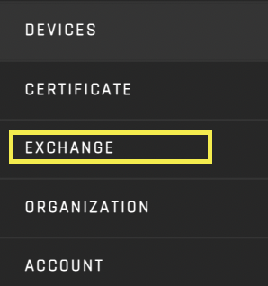
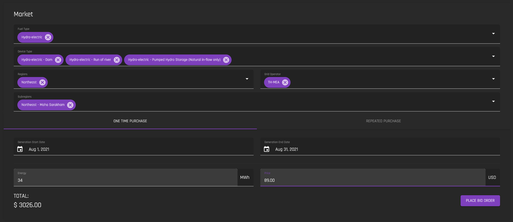
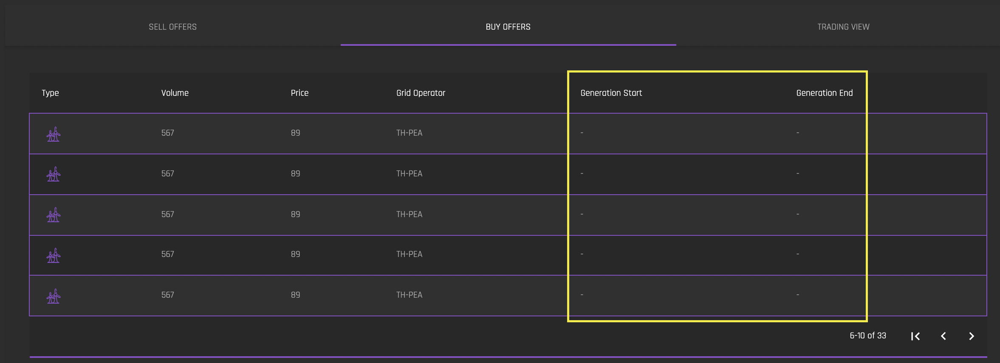

# Exchange

**Source code on github:** https://github.com/energywebfoundation/origin/tree/master/packages/trade 

The Exchange interface handles the platform’s market activity ([bids](./user-guide-glossary.md#bid), [asks](./user-guide-glossary.md#ask), trades and sales) for buyers and sellers. It integrates with certificate issuance to allow for trading of [Energy Attribute Certificates (EACs)](./user-guide-glossary.md#energy-attribute-certificate) on the blockchain. 

The Exchange portal has seven views. The purpose and utility of each view is explained in detail below.

1. **[View Market:](#view-market):** Place bid orders and view your bid/sell offers
2. **[All bundles:](#all-bundles):** View and purchase certificate bundles
3. **[Create bundle:](#create-bundle)** Create a bundle of your certificates to sell
4. **[My Trades:](#my-trades):** View your organization’s sales and purchases
5. **[My Bundles:](#my-bundles):** View and manage your organization's certificate bundles
6. **[My Orders:](#my-orders):** View your organization’s [bids](./user-guide-glossary.md#bid), [asks](./user-guide-glossary.md#ask) and [demands](./user-guide-glossary.md#demand)
7. **[Supply](#supply):** Automate certificate requests for your organization’s devices

## View Market

### Market
The Market form is where a buyer makes a purchase request ([bid](./user-guide-glossary.md#bid)) for certificates for a given volume, time period and other specifications. 

To place a one-time ‘buy’ offer (which is the default behavior), fill in the specifications in the Market form. This reference implementation form specifies the type of energy, the location, the generation time period, total Mwh and price that a buyer wants to purchase certificates for. **Note that you must, at a minimum, specify the “Fuel Type”, “Device Type”, “Generation Start Date”, ‘Generation End Date”, Energy Mwh amount and “Price” in order to place a bid.**

Once you click “Place Bid Order”, you will see this ask reflected in the “Buy Offers” tab below the Market form:

You can also see your Buy Offers in the ‘My Orders’ view in ‘Bids’. 

#### Repeated Purchase/Demand Orders
To make a buy order for repeated periods (daily, weekly, monthly, yearly) within a given date range, select “Repeated Purchase”, and then specify the frequency for which you would like certification for:  

Once you click “Place Demand Order”, you will see your asks reflected in the “Buy Offers” tab below the Market form. The number of offers will depend on the period you chose to purchase for in a given generation start and end date. For example, if you chose a frequency of ‘daily’ in a generation time period of one week, you will see 7 entries, each with the volume and price for that purchase period (daily). **Repeated Purchase order will not have a ‘Generation Start’ or ‘Generation End’ specified:**

You can also see your Buy Offers in the [‘My Orders’](#my-orders) view under [‘Demands’](#demands). 

### Sell Offers
The “Sell Offers” tab lists all of the Mwh for your organization’s certificates that are actively for sale on the exchange. Users can put certificate  up for sale in the [Exchange Inbox interface](./user-guide-certificate.md#exchange-inbox) using the [“Sell” tab](./user-guide-certificate.md#sell). 

*Note that bundles are not included in “Sell” offers. They must be purchased directly from the seller using the “All Bundles”(#all-bundles) interface. 

## All Bundles

## Create Bundle

## My Trades

## My Bundles

## My Orders

### Demands

## Supply

