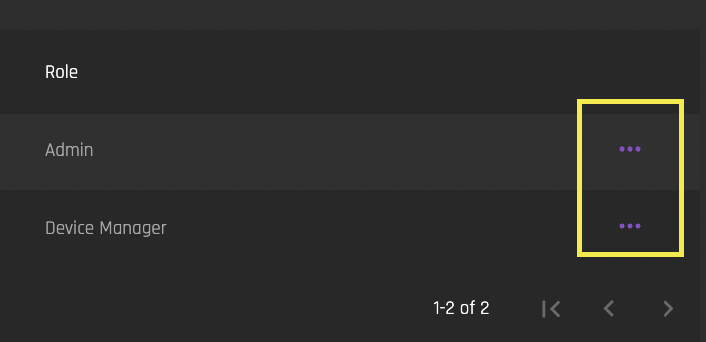
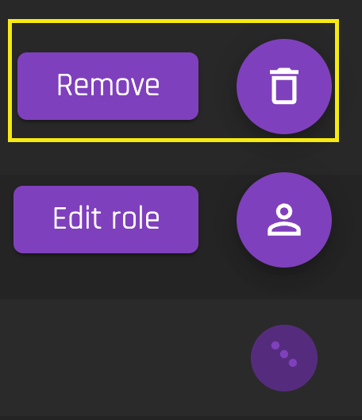
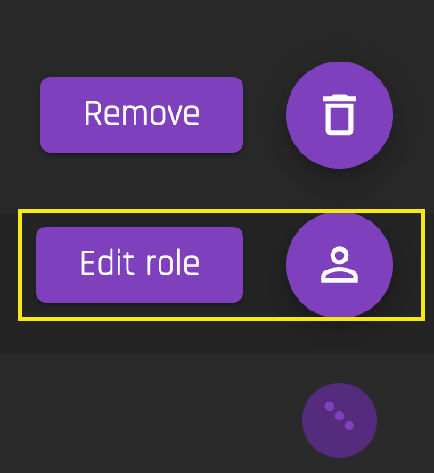
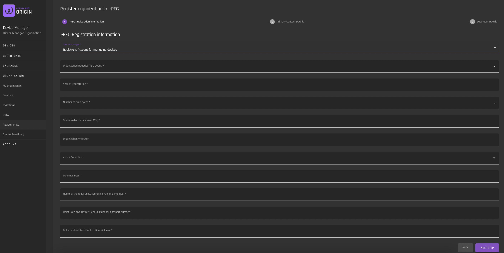
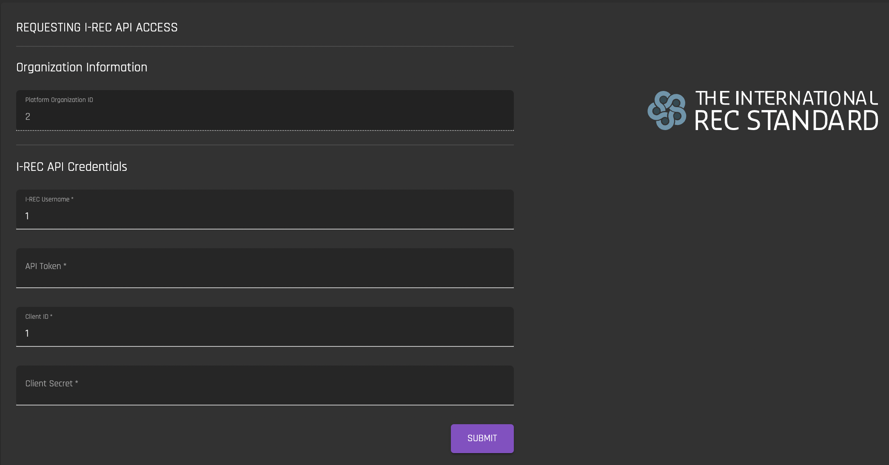

# Organization
**Reference Implementation:** https://origin-ui-canary.herokuapp.com/organization/my

**Source code on github:** https://github.com/energywebfoundation/origin/tree/master/packages/organizations

An [Organization](./user-guide-reg-onboarding.md#organizations) is the top level of user-hierarchy in the Origin platform.  

The Organization interface allows you to manage and invite members to your organization, and to request I-REC API access for your organization. **In the reference implementation, this interface is only visible to users with Admin privileges**. 

The Organization portal has five views. The purpose and utility of each view is explained in detail below.

[!organizationViews](images/organization/organization-views.png)

1. **[My Organization:](#my-organization)** Allows an admin user to view their Organization Information.
2. **[Members:](#members)** Allows an admin user to view and manage organization members. 
3. **[Invitations](#removing-a-member):** Allows an admin user to view a list of pending (sent) and accepted (received) invitations for membership. 
4. **[Create Beneficiary:](#create-beneficiary)** Allows an admin user to designate a beneficiary to receive retired certificates
5. **[Register I-REC:](#connect-i-REC)** Allows an admin user to register with I-REC.
6. **[Connect I-REC:](#connect-i-REC)** Allows an admin user to create an API connection with I-REC using their I-REC credentials.

## My Organization

**Reference Implementation:** https://origin-ui-canary.herokuapp.com/organization/my  

### Organization Information

The information provided when the organization was registered on the Origin platform. You can read more about Organization Registration [here](./user-guide-reg-onboarding.md#registering-organizations)

### I-REC Registration Information

These details are generated when I-REC registration is completed on the Origin Platform. **This table will not be visible if you have not registered your organization with I-REC on the platform.** Read about I-REC registration [here](#connect-i-REC). 

### Primary Contact Details

The contact details of the organization’s primary contact. These details are generated when I-REC registration is completed on the Origin Platform. **This table will not be visible if you have not registered your organization with I-REC on the platform**. Read about I-REC registration [here](#connect-i-REC).  

### Lead User Details

The contact details of the organization’s lead user. These details are generated when I-REC registration is completed on the Origin Platform. **This table will not be visible if you have not registered your organization with I-REC on the platform**. Read about I-REC registration [here](#connect-i-REC).  

## Members
**Reference Implementation:** https://origin-ui-canary.herokuapp.com/organization/members  

This view provides a list of current Organization members and their roles in the system. You can remove a member or edit a member’s role by clicking on the edit indicator:

### Removing a Member  

To remove a member, click “Remove”. They will be notified via email that they have been removed from the organization.  

### Changing a Member's Role

To change a member’s role, “Edit role” and select their new role from the dropdown menu. They will be notified via email that their role has been changed. 

## Invitations
**Reference Implementation:** https://origin-ui-canary.herokuapp.com/organization/invitations 

This view provides admins a list of member invitations that have been sent to email addresses. 

Invitations are marked as “pending” if the invitee has not accepted. Invitations are marked as “accepted” if the invitee has accepted. 

## Invite  
**Reference Implementation:** https://origin-ui-canary.herokuapp.com/organization/invite  

This view allows admins to invite members to the organization. A role must be selected for the invitee when the invitation is created. You can see a list of the reference implementation's roles and their privileges [here](./user-guide-reg-onboarding.md#user-roles-and-hierarchy). 

When the invitation is sent, the invitee will receive the invitation in their inbox. You can view the invitation status in the Invitations list. It will be marked as “pending”, until the invitee has accepted using the email. After the invitee accepts, the invitation status will be “accepted.”

## Create Beneficiary
**Reference Implementation:** https://origin-ui-canary.herokuapp.com/organization/create-beneficiary

This view allows admins to create beneficiaries or recipients for retired certificates. Certificates can be retired to the beneficiary's account at the time of retirement. You can read about the certificate retirement process [here](./user-guide-certificate.md#retire). 

## Register I-REC

**Reference Implementation:** **Reference Implementation:** https://origin-ui-canary.herokuapp.com/organization/register-irec

This view allows admins to enter their I-REC registration information to create an I-REC account. **Note that this interface is only visible if you have not yet registered with I-REC. Once you successfully reigster with I-REC, the 'Connect I-REC' interface will be shown.** 

When you register with I-REC, you will need to select an I-REC account type:
 

Once your registration is confirmed by I-REC, you will receive I-REC credentials via email that can be used to [connect to the I-REC API](#connect-i-REC). 

## Connect I-REC
https://origin-ui-canary.herokuapp.com/organization/connect-irec

This view allows admins to enter their I-REC credentials to create an API connection with I-REC. The IREC API credentials come directly from I-REC. **Note that this interface is only visible if you have [registered with I-REC](#register-i-REC) through the Origin platform.** 
The API connection is needed to perform the following functions on the Origin platform:

