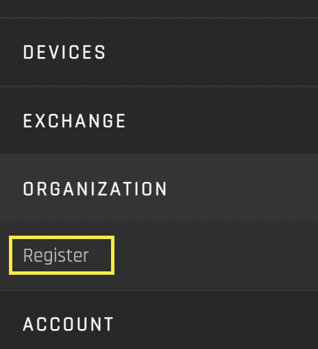
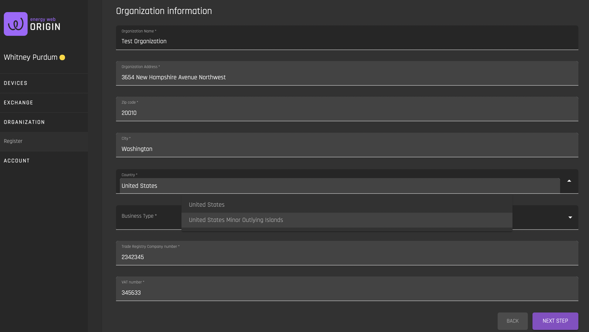
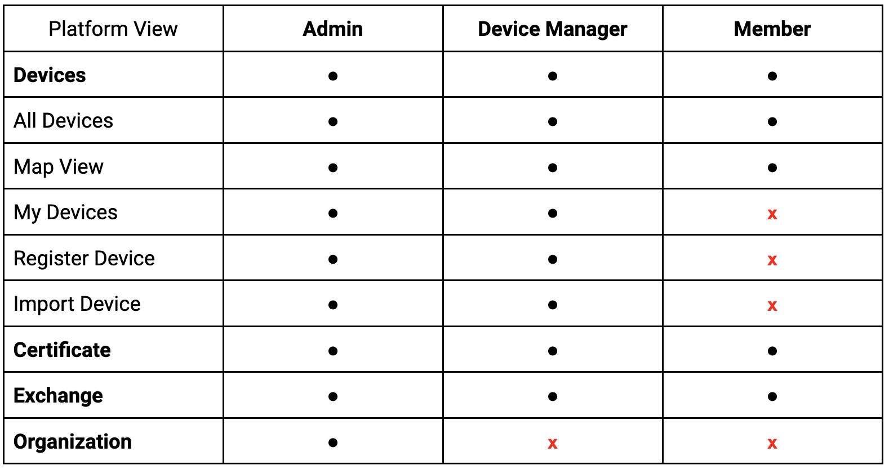
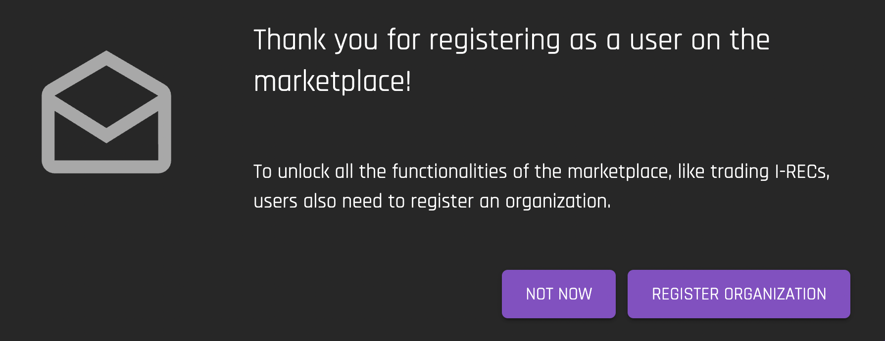
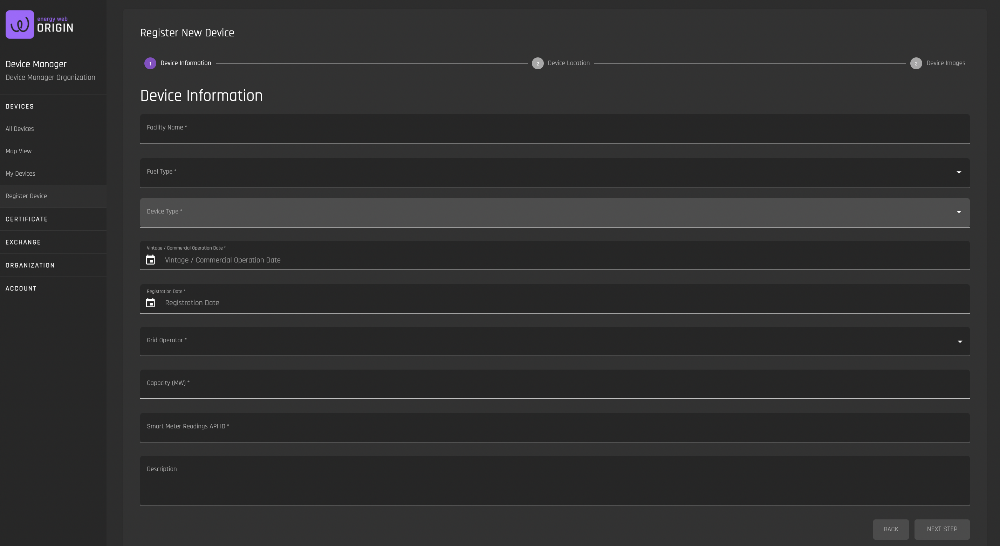
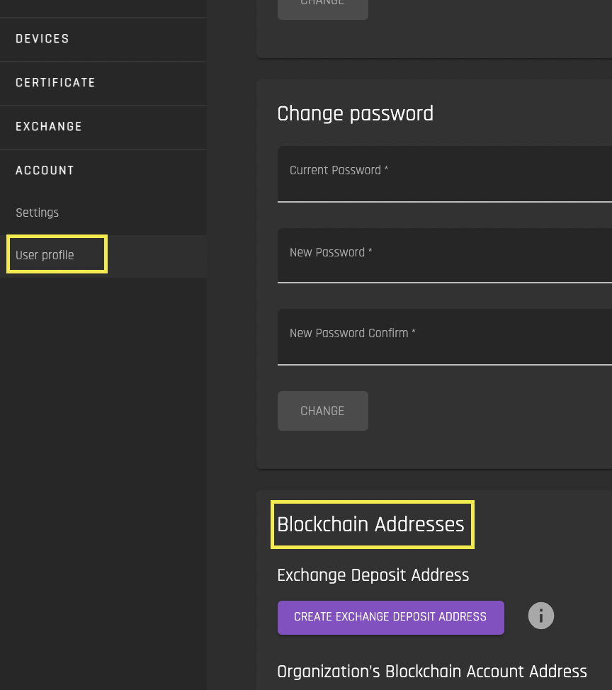
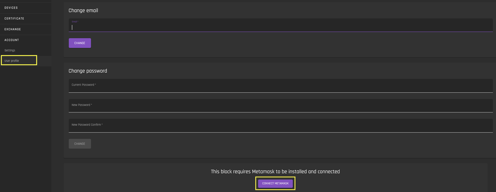
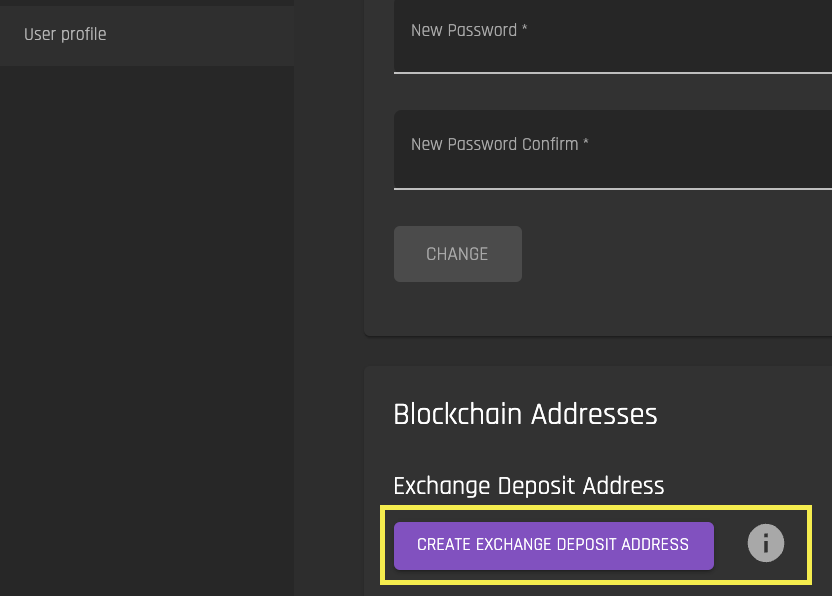
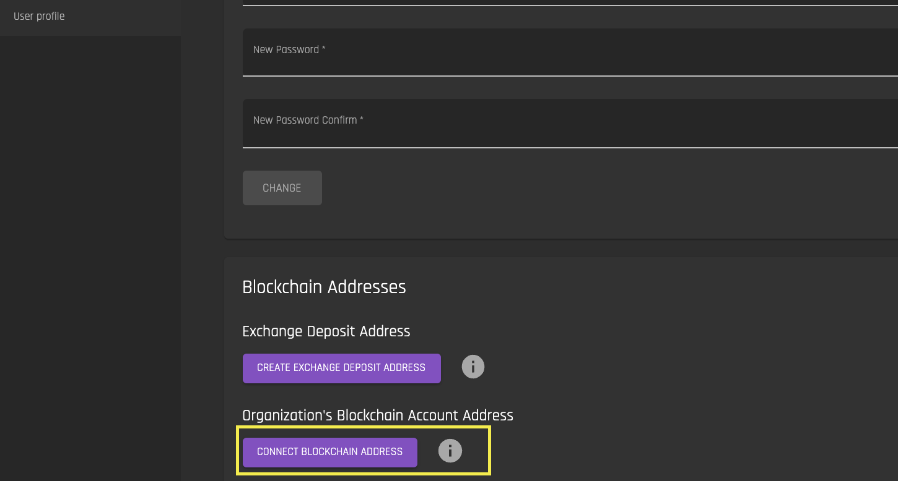

# User Registration and Onboarding  
A guide for enrolling users, organizations and devices on the Origin platform.

## User Roles and Hierarchy  

To perform actions in the Origin marketplace, you must be a registered [user](#users). User registration is necessary because actions like device registry and requesting and claiming certificates must be mapped to specific entities in the system. __Registration is the only way to ensure accountability and prevent double counting__. After registration you can log in with email and password.  

Some actions on the platform require you to be associated with a registered [organization](#organizations).Only users registered with an organization can:  

1. Register [devices](./device-guides/device-guide-intro.md). The user must have the role of Admin or Device Manager within an Organization (see [User Roles](#user-roles) below).  
2. Request [certificates](./user-guide-glossary.md#energy-attribute-certificate) issuance. The user must have the role of Admin or Device Manager within an Organization (see [User Roles](#user-roles) below) in order to do this.  
3. Post [asks](./user-guide-glossary.md#ask) on the [exchange](./user-guide-exchange.md) 
4. [Claim certificates](./certificate-guides/claims-report.md) for different purposes such as sustainability reporting  

In order to mirror typical organizational structures, the Origin marketplace has a hierarchy of **organizations, users and devices.**  

Devices must be registered by a user. Users must be associated with a registered organization and have a specific role in order to register a device.

### Organizations
Users and their permissions in the Origin marketplace are tied to digital entities that are called 'organizations'. In order to perform actions on the marketplace like register devices or trade certificates you have to belong to an approved organization. If you are managing the marketplace for your company, you should register a new organization.  

As the name suggests, organizations are mostly companies that specify permissions for the user accounts of their employees. To ensure that only registered users can perform actions in the system, every user has to be associated with an organization, be a lead user or go through a Know-Your-Customer (KYC) process as a user.

Every organization has an admin user that must provide a set of mandatory information to register the organization. All required information and documents are provided through a user interface.  After the organization is successfully registered, the admin user account can perform user management. New users can be invited to join the organization and can be given specific permissions.  

If Origin is integrated into a certificate registry, such as I-REC, organizations that own generation devices have to be authenticated as active members of the certificate registry to interact with the system. This means that in order for users to be allowed to perform actions like device management or requesting certificates, their organization must have a confirmed active membership in the registry. Accordingly, if the membership is suspended or terminated, this will prevent all the users associated with this organization from interacting with the Origin marketplace. 

#### Registering Organizations
If you are not already a member of an organization on the platform, you can view the organization registration interface here: [https://origin-ui-canary.herokuapp.com/organization/register](https://origin-ui-canary.herokuapp.com/organization/register), or click on ‘Organization’ on the side panel and select 'Register’ (note that if you are already associated with an organization, this interface will not be accessible):  

 

You can view the suggested Know Your Customer (KYC) fields in the reference implementation for adding Organization Information, Authorized Signatory Information and supporting documents.   
These fields can be changed based on implementation needs.  

### Users  

To manage users and devices, request certificates, post supplies and demands, and claim certificates, users need to have an account in Origin. Users are associated with an [organization](#organizations). The main account of every organization is the lead user. Organizations use this account to create other user accounts and perform user management. The lead user sets permissions for all created users based on their roles in the organization. Roles and their permissions are explained [below](#user-roles). All users that are created by the organization's admin user are automatically associated to the organization and do not have to go through any additional KYC process. Users with the role of Admin or Device Manager can only be a member of one organization within the system at a time. 

Buyer organizations mostly do not require synchronization with a certificate registry (e.g. I-REC). As a result, they will not need an account in the compliance registry and Origin is the single point of truth for their user accounts. Buyers only have to register with Origin to interact with the marketplace, they do not need to register with an organization.

View how to register users [below](#registering-users).

#### User Roles
Users have one of three roles within an organization:  

1. Admin
2. Device Manager 
3. Member

##### User Role Permissions
Role Permissions for the [reference implementation](https://origin-ui-canary.herokuapp.com/) are as follows: 

| Roles          | Permissions                                                                                                                                                                                                                                                                                                                                                                     | Notes                                                                                                                                                                                                  |
| -------------- | ------------------------------------------------------------------------------------------------------------------------------------------------------------------------------------------------------------------------------------------------------------------------------------------------------------------------------------------------------------------------------- | ------------------------------------------------------------------------------------------------------------------------------------------------------------------------------------------------------ |
| Org admin      | <ul><li>Add and remove users to the organization</li> <li>Register the organization with the issuing body (e.g. I-REC)</li> <li>Delete the organization</li> <li>Assign the admin role to other org members</li> <li>Start and accept device change of ownership</li> <li>Perform all actions tied to the organization, organization’s certificates, and organization’s devices</li> | <ul><li>Creator of the organization automatically becomes an organizational admin</li> <li>There can be multiple org admins</li> <li>Only members of the organization can become org admins</li> </ul> |
| Device manager | <ul> <li>Register new devices and device groups</li> <li>Request certification </li> <li>Delete devices</li> </ul>                                                                                                                                                                                                                                                              | <ul><li> The device manager is also an org member and can perform all actions of an org member</li></ul>                                                                                               |
| Org Member     | <ul><li>Post bids and asks</li><li>Transfer certificates</li><li>Claim certificates</li></ul>                                                                                                                                                                                                                                                                                   | <ul><li>Can be in multiple organizations, in each organization has a different role </li></ul>          

Each role has varying access to the interfaces on the platform:

**Note that if a user creates/registers an organization, they are automatically an administrator.** Otherwise, users are given a designated role when an administrator invites them to join the organization. Read more about how to invite members [here](./organization-guides/invite.md).

#### Registering Users

To view the user registration interface, navigate to [https://origin-ui-canary.herokuapp.com/auth/register](https://origin-ui-canary.herokuapp.com/auth/register), or click on “Register” in the top right hand corner of the Origin interface:  

  

You can view and populate the suggested Know Your Customer (KYC) fields in the reference implementation for adding User Information. __Note that these fields can change based on implementation needs__.  

*Note that if a user is not associated with an [organization](#organizations), the user will be prompted to register an organization once their email address is confirmed:

#### Inviting New Users
Admin users can invite new users to joing their organization and assign them a specific role within the organization when the invitation is created. You can learn how to invite new members [here](./organization-guides/invite.md). 

### Devices  

‘Devices’ are electricity generating assets (e.g solar pv, hydroelectric dam, steam turbine). Because [Energy Attribute Certificates](./user-guide-glossary.md#energy-attribute-certificate) are always tied to the device for which generation evidence was submitted, generation devices must be registered with Origin. The certificate inherits many characteristics from the generation device. As a result, it is essential to have certainty about which device the certificate came from and that the stated device characteristics are correct. Only allowing generation evidence from registered devices therefore facilitates traceability and prevents misconduct. If Origin is fully integrated with a certificate registry (e.g. I-REC), it relies on the registration process implemented by this registry. 

All necessary information and documents to register a device in Origin can be provided through the user interface. If Origin is integrated with a compliance registry, a registration request is automatically forwarded to the registry, where their registration process is initiated. Everything that involves the registration process of the registry, e.g. if there is a need for a on-site visit or additional documents, is handled directly between the user and the registry. Devices that are already registered with the compliance registry must to be imported into Origin (read about how to import devices [here](./device-guides/import-device.md)). Only users that are authenticated as active members of the certificate registry can import their devices. This way it is ensured that no one else can import devices and claim certificates in Origin but the verified owner of the device. 

 __You do not need to be a registered user in order to see a list of registered devices in the Origin platform, or posted supplies and demands__. You will be asked to register once you want to interact with the system further.  
 
 Read more about devices and device management in Origin [here](./device-guides/device-guide-intro.md). 
 
#### Registering Devices  
In order to register a device, the user must be registered with an existing organization and must have a user role of Admin or Device Manager. Read more about user roles and permissions [here](#user-role-permissions).

To view the device registration interface, navigate to [https://origin-ui-canary.herokuapp.com/device/register](https://origin-ui-canary.herokuapp.com/device/register), or click on Device on the side panel and select 'Register Device':  

You can view the suggested device registration fields in the reference implementation for adding Device Generation Information, Device Location Information and supporting documents. These fields can be changed based on implementation needs.  

## Connecting to the Blockchain

[https://origin-ui-canary.herokuapp.com/account/profile](https://origin-ui-canary.herokuapp.com/account/profile)

Origin uses the Energy Web blockchain for traceability and verification of certificate ownership. Certificates are issued on the blockchain as tokens (you can read more about the certificate structure [here](https://energyweb.atlassian.net/wiki/spaces/OD/pages/883916918/Certificate+structure)).  

If your organization's users have registered devices on the Origin platform and want to be issued certifcates, sell certificates, trade certificates or retire certificates, the organization will need an Exchange Deposit address and an Organization Blockchain Account address, which are explained below. 

### Blockchain Addresses
Your blockchain addresses for the Origin Exhange are found under 'Account' in your 'User Profile':

In order to connect to your Blockchain Addresses, you will need to have [MetaMask installed](https://metamask.io/). Once installed, you will need to connect to the Volta Test Network, which is the Energy Web Chain's test environment.  

You can learn more about MetaMask and how to connect to the Volta Test Network [here](https://energy-web-foundation.gitbook.io/energy-web/getting-started-with-ew-dos).    

Once you sign into MetaMask and connect to the Volta Test Network, you can click "Connect MetaMask".

Once connected, you will see two Blockchain Addresses:

#### Exchange Deposit Address

The Exchange Deposit Address is the address that is used by the marketplace's integrated exchange module. This address is auto-generated by the Origin platform.    

- If you are a member of an organzation that already has an Exchange Deposit Address, this address will be pre-populated after you connect to MetaMask. 
- If you are creating an organization, or you are not a member of an organization, click on 'Create Exchange Deposit Address' to have an address generated:

[Energy Attribute Certificates (EACs)](./user-guide-glossary.md#energy-attribute-certificate) are represented as blockchain tokens (read more about the certificate structure [here](https://energyweb.atlassian.net/wiki/spaces/OD/pages/883916918/Certificate+structure)), so they must be transferred to the blockchain in order to be deposited to the Exchange. The Origin Exchange creates a unique smart contract wallet for each user that wants to trade on the exchange. This wallet acts as a deposit account on the exchange. **The address of this wallet is the Exchange Deposit Address.**  

As common practice for blockchain exchanges, this deposit account is tied to the organization but _owned by the Exchange operator on-chain_ - this is why the address is auto-generated by the platform and not connected to any account in your MetaMask wallet. By depositing EACs to the Exchange, users put them in the custody of this operator. This ensures that all operations that are performed on the Origin Exchange are valid.

**If you want to post certificates for sale, transfer them to another Exchange Deposit Address, or export them to an I-REC account, they must be in the Exchange account, which is tied to your Organization's Exchange Account Address.** You can choose to withdraw EACs from the Exchange account to your Blockchain account (which is tied to your [Organization's Blockchain Account Address](#organization-blockchain-account-address)) if you want to retire the certificate. *Deposits and withdrawals are the only on-chain events that happen when using the Exchange*.

You can view your certificates that are in the Exchange account in the [Exchange Inbox interface](./certificate-guides/exchange-inbox.md).

#### Organization Blockchain Account Address

**If you want to withdraw certificates from the exchange in order to retire or claim them for sustainability reporting purposes, they must be in the Blockchain account, which is tied to your Organization's Blockchain Account Address.** You can choose to deposit your EACs from the Blockchain account to your Exchange account (which is tied to your [Organization's Exchange Deposit Address](#exchange-deposit-address)) if you want to [make the certificate eligible for sale](./certificate-guides/exchange-inbox.md#sell) on the exchange.  

You can view your certificates that are in the Blockchain account in the [Blockchain Inbox interface](./certificate-guides/blockchain-inbox.md).  

The Blockchain Account Address is the MetaMask address that is used when the admin first sets up the Organization's blockchain account address. **Multiple users from the same organization can have access to this wallet address by importing the private key of this wallet into their MetaMask.** You can read the MetaMask documentation on how to import an account using a private key [here](https://metamask.zendesk.com/hc/en-us/articles/360015489331-How-to-import-an-Account).  

If you or your organization has not connected a blockchain address, select the account that you want to designate as the Blockchain Account Address in MetaMask and click "Connect Blockchain Address":

